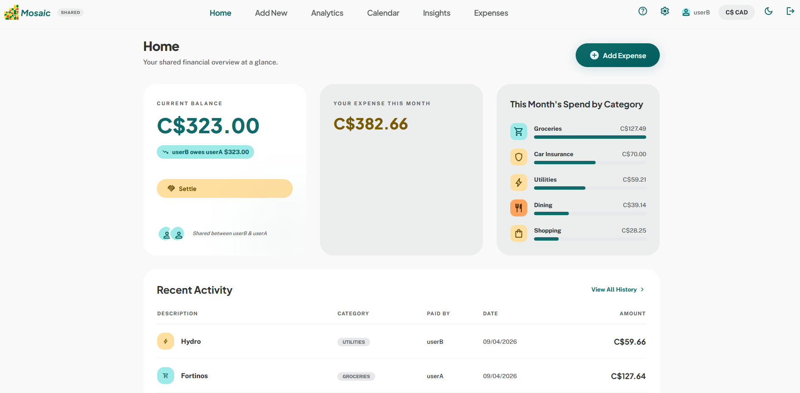
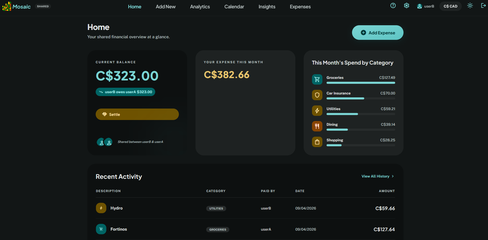
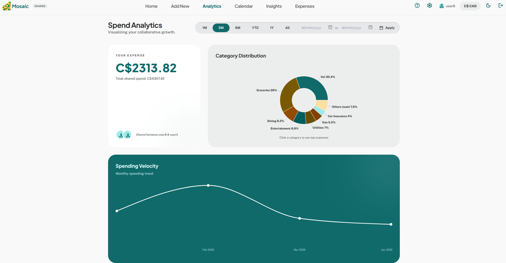
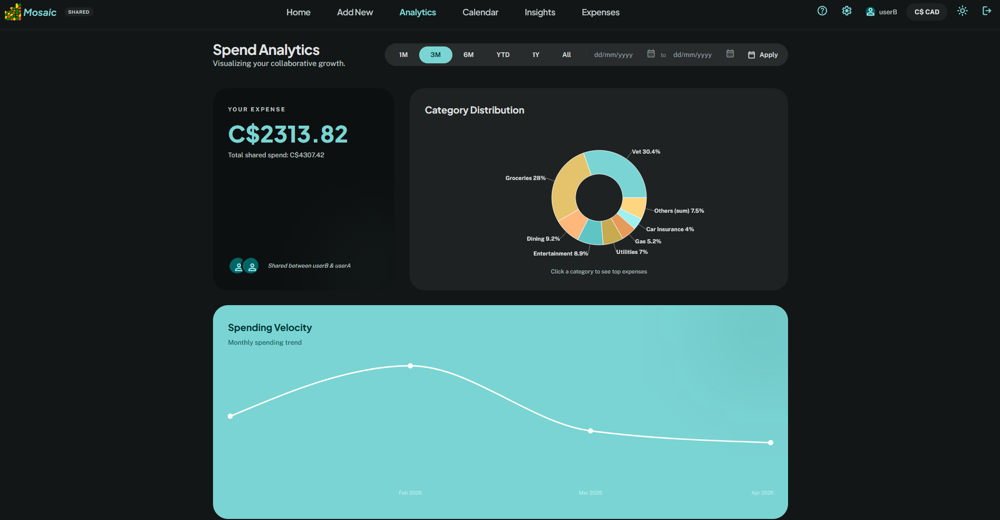
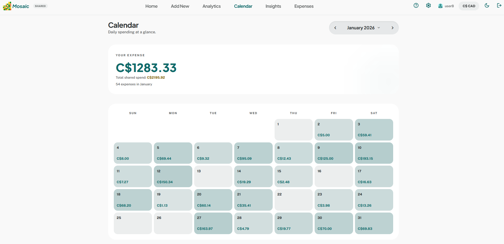
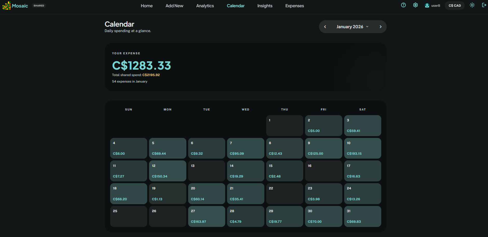
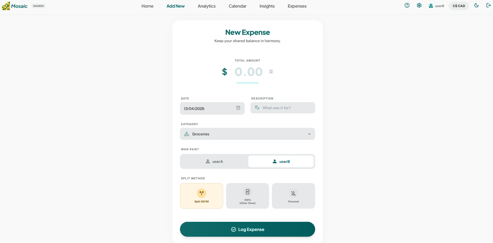
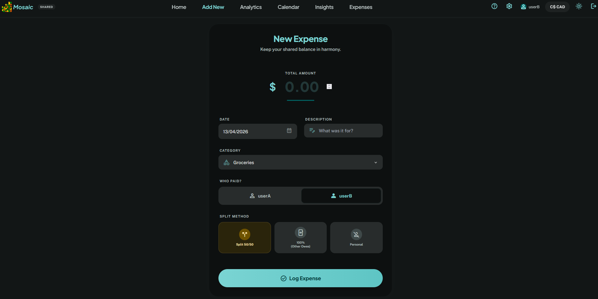
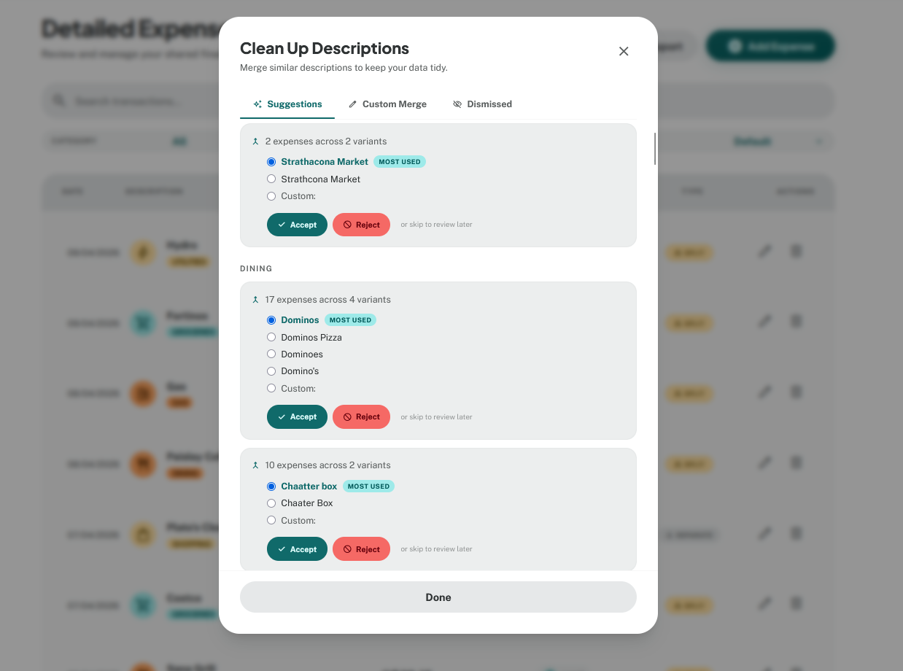
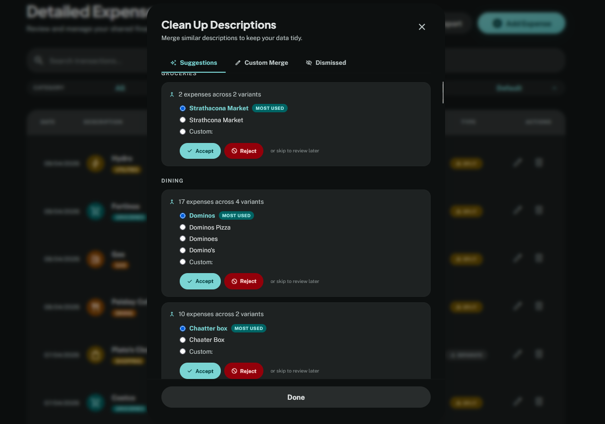

<p align="center">
  
</p>

<h1 align="center" style="margin-bottom: 0; border-bottom: none;">Mosaic</h1>
<p align="center"><i>Local First Expense Tracker</i></p>

<br>

<p align="center">
  <a href="https://github.com/sundarep-ai/Mosaic/actions/workflows/tests.yml"></a>
  &nbsp;
  <a href="https://github.com/sundarep-ai/Mosaic/releases"></a>
  &nbsp;
  <a href="https://hub.docker.com/r/srpraveen97/mosaic"></a>
  &nbsp;
  
</p>

<p align="center">
  <a href="#screenshots">Screenshots</a>&nbsp;&bull;&nbsp;<a href="#whats-new-in-v200">What's New</a>&nbsp;&bull;&nbsp;<a href="#why-mosaic">Why Mosaic</a>&nbsp;&bull;&nbsp;<a href="#features-at-a-glance">Features</a>&nbsp;&bull;&nbsp;<a href="#setup">Setup</a>&nbsp;&bull;&nbsp;<a href="#method-2-docker">Docker</a>&nbsp;&bull;&nbsp;<a href="FEATURES.md">Full Docs</a>&nbsp;&bull;&nbsp;<a href="CONTRIBUTING.md">Contributing</a>
</p>

---

Mosaic is a personal expense tracker that runs entirely on your own machine. No subscriptions, no data sent anywhere. Log expenses, understand your spending patterns, and get automated analysis all locally. Mosaic also scales to two: a Blended mode lets couples track personal and shared expenses side by side without mixing them up.

---

## Screenshots

<table>
  <thead>
    <tr>
      <th align="center">Light</th>
      <th align="center">Dark</th>
    </tr>
  </thead>
  <tbody>
    <tr>
      <td align="center"><strong>Dashboard</strong> — balance, category breakdown, recent activity</td>
      <td align="center"></td>
    </tr>
    <tr>
      <td></td>
      <td></td>
    </tr>
    <tr>
      <td align="center"><strong>Analytics</strong> — category distribution, spending velocity</td>
      <td align="center"></td>
    </tr>
    <tr>
      <td></td>
      <td></td>
    </tr>
    <tr>
      <td align="center"><strong>Calendar</strong> — heat-map view, click any day to drill down</td>
      <td align="center"></td>
    </tr>
    <tr>
      <td></td>
      <td></td>
    </tr>
    <tr>
      <td align="center"><strong>Add Expense</strong> — split methods, category auto-suggest</td>
      <td align="center"></td>
    </tr>
    <tr>
      <td></td>
      <td></td>
    </tr>
    <tr>
      <td align="center"><strong>Clean Up</strong> — AI deduplication, bulk merge</td>
      <td align="center"></td>
    </tr>
    <tr>
      <td></td>
      <td></td>
    </tr>
  </tbody>
</table>

---

## What's New in v2.0.0

*Released 2026-07-15*

A major release focused on making the numbers trustworthy, the insights genuinely useful, and the day-to-day flow faster. Highlights:

**New features**

- **Itemized split calculator** — for a mixed receipt (some items yours, some your partner's, some shared, some taxable), a calculator in the Add Expense form works out who owes what — including a custom tax rate — and drops the result straight into the expense.
- **Custom categories** — create your own categories from the Add Expense form. They're validated to prevent look-alike duplicates (`groceries` vs `Groceries`) that would fragment your analytics.
- **Insights, redesigned** — smarter recurring-payment detection (now catches bimonthly, semiannual, and series with a skipped cycle), **price-increase alerts** that tell you the story (*"Netflix $15.99 → $17.99 since March · +$24/yr"*), **new-subscription alerts**, a rebuilt **forecast** (this-month "on pace" total, next-month estimate with a likely range, upcoming bills, and a subscription roll-up), and anomaly detection that no longer gets fooled by one big purchase. Insights now live on their own attention-first page instead of cluttering Home.
- **Per-user preferences** — your currency and income-tracking choices are now saved to your account and follow you across devices and browsers, instead of being stuck on one device.
- **Faster expense entry** — **Save & add another**, a live split preview under the amount (*"50/50 → you'll owe Bob $12.50"*), settle-up that prefills the amount and direction, and crash/session-safe entry (a half-typed expense survives a session timeout and offers to restore).
- **Better History & export** — filtered views are now shareable/bookmarkable via the URL and survive editing a row, pagination reaches your oldest expenses, filters from Calendar/Analytics show a clear pill, and the spreadsheet export matches exactly what's on screen and now includes an **Income** sheet.
- **Analytics on mobile**, in-app toast notifications, an overspend callout on the income-flow chart, and dark-mode contrast fixes.

**More reliable & correct**

- **Money reconciles everywhere** — your balance, monthly summary, and "my spend" figures now always agree, including a fixed odd-cent rounding bug that could make them differ by a cent. Reimbursements and settlement payments follow one consistent convention across every total.
- **Accurate forecasting** — fixed an inverted-weighting bug that skewed the spending forecast.
- **Safer account deletion** — deleting one account no longer silently drops the other person's shared expenses from their totals or locks those rows from editing.
- **Hardened backups** — every backup is verified after it's written, backups now also fire on data changes (not just at startup), and the app refuses to start on a corrupt database rather than backing up over a good copy.
- **Safer data import** — the migration scripts now require you to state your date format (no more silent day/month swaps) and import all-or-nothing instead of quietly dropping bad rows.
- **Security hardening** — path-traversal fix on static file serving, sliding session expiry (an active session no longer logs you out mid-use), and fixes to mode-switching/login edge cases that could lock a user out.

For the complete feature reference, see [FEATURES.md](FEATURES.md).

---

## Why Mosaic

**Insights that actually tell you something.**
Mosaic analyses your spending automatically: it detects recurring expenses, flags anomalies, alerts you when a category spikes above its 3-month average, and forecasts next month's spending. No manual setup, it works from the data you've already logged.

**AI-powered description clean-up, on your device.**
Tracked the same grocery store as "Foodbasics", "Food Basics", and "food basics"? The Clean Up tool uses local ONNX embeddings to find description variants that refer to the same thing and lets you merge them in bulk. No API calls, no data leaving your machine.

**A calendar that shows where your money goes.**
A monthly heat-map calendar colours each day by spending intensity, making it easy to spot heavy spending days at a glance. Click any day to see exactly what you bought.

**Runs locally, your data stays yours.**
Everything lives in a local database on your machine. Mosaic never leaves home. No third-party access, no cloud sync unless you explicitly configure it (for OneDrive backups).

**Scales to two when you need it.**
Couples can log personal and shared expenses side by side. Mosaic tracks who owes what, splits costs fairly, and keeps each person's private spending to themselves.

---

## Features at a glance

| | |
|---|---|
| **Dashboard** | Monthly balance, your expense share, income summary, spend by category, recent activity |
| **Add Expense** | Fuzzy description matching, category auto-suggest, custom categories, flexible split methods |
| **Analytics** | Date-range charts, Sankey income-flow diagram, category drill-down, largest outlays |
| **Calendar** | Heat-map month view, income badges, click-to-filter drill-down |
| **Insights** | Anomaly detection, recurring expense tracker, category trend alerts, spend forecast, weekend vs. weekday analysis |
| **History** | Searchable and filterable expense table, edit, delete, spreadsheet export |
| **Clean Up** | AI embedding-based description deduplication with bulk merge |
| **Modes** | Personal (solo), Shared (split everything), Blended (mix of both) |

Full feature documentation: [FEATURES.md](FEATURES.md)

---

## Tech stack

| Layer | Technologies |
|---|---|
| Backend | Python 3.10+, FastAPI, SQLModel, SQLite (WAL mode), fastembed (ONNX embeddings), bcrypt, openpyxl |
| Frontend | React 18 (Vite), Tailwind CSS 3, React Router 6, Recharts, Fuse.js |

---

## Setup

Choose the method that fits your situation:

| Method | Best for | Requirements |
|---|---|---|
| [Production](#method-1-production) | Self-hosting on a machine you control | Python 3.10+, Node.js 18+ |
| [Docker](#method-2-docker) | Cleanest self-hosting, no Python/Node needed on host | Docker Desktop |
| [Development](#method-3-development) | Local dev, experimenting | Python 3.10+, Node.js 18+ |

The database (`mosaic.db`) is created automatically on first start — no manual setup required. Create up to 2 user accounts through the web UI after launching.

---

### Method 1: Production

FastAPI serves both the API and the built frontend from a single process. No Docker, no reverse proxy.

**Prerequisites:** Python 3.10+, Node.js 18+

```bash
git clone https://github.com/sundarep-ai/Mosaic.git
cd Mosaic
```

**Backend setup:**

```bash
cd backend
copy config.example.py config.py # Windows
# cp config.example.py config.py # macOS / Linux
python -m venv venv
venv\Scripts\activate          # Windows
# source venv/bin/activate     # macOS / Linux
pip install -r requirements.txt
```

Create `backend/.env`:

```env
SECRET_KEY=<long random string>
ENV=production
COOKIE_SECURE=false

# Optional: cloud backup path
# BACKUP_PATH=C:/Users/yourname/OneDrive/Mosaic-Backups
```

**Build the frontend:**

```bash
cd ..
cd frontend
npm install
npm run build
```

**Run:**

```bash
cd ..
cd backend
uvicorn main:app --host 0.0.0.0 --port 8000
```

Open **http://localhost:8000** (or `http://<your-machine-ip>:8000` from other devices on your network).

**To update to a new version:**

```bash
git pull origin main
cd frontend && npm install && npm run build
cd ..
cd backend && uvicorn main:app --host 0.0.0.0 --port 8000
```

---

### Method 2: Docker

A single container running FastAPI, which serves both the API and the web UI. By default Compose **pulls a prebuilt, versioned image** from Docker Hub ([`srpraveen97/mosaic`](https://hub.docker.com/r/srpraveen97/mosaic)), so there's no local build step. All data persists in a Docker named volume across restarts and updates.

**Prerequisites:** [Docker Desktop](https://www.docker.com/products/docker-desktop/)

You only need the `docker-compose.yml` and a `.env` file to run Mosaic, but cloning the repo is the simplest way to get them:

```bash
git clone https://github.com/sundarep-ai/Mosaic.git
cd Mosaic
```

Create a `.env` file (Docker Compose reads this automatically):

```bash
copy .env.docker.example .env # Windows
# cp .env.docker.example .env # Linux
```

Edit `.env` and set your secret key:

```env
SECRET_KEY=<long random string>
# Generate with: python -c "import secrets; print(secrets.token_urlsafe(48))"

# Optional: which release to run (default: latest). Pin a version for reproducible deploys.
# MOSAIC_VERSION=2.0.0

# Optional: change the port (default is 8000)
# MOSAIC_PORT=8080

# Optional: set to true if serving over HTTPS
# COOKIE_SECURE=true
```

**Pull and start:**

```bash
docker compose pull
docker compose up -d
```

Open **http://localhost:8000** (or your `MOSAIC_PORT` if you changed it).

> **Note:** The published image already includes the fastembed ONNX model (~45 MB), so the container starts instantly — no download or build on first run.

**To update to a new version:**

```bash
docker compose pull      # fetch the newest image (or bump MOSAIC_VERSION in .env)
docker compose up -d     # recreate the container with the new image
```

To pin a specific release instead of tracking `latest`, set `MOSAIC_VERSION=2.0.0` in `.env` and re-run the two commands above. Your data (database, audit logs, backups, avatars) is stored in the `mosaic-data` Docker volume and is never touched by an update.

> **Building from source instead:** contributors can build the image locally rather than pulling it with `docker compose up -d --build` — the `build:` block is kept in `docker-compose.yml` for exactly this. The first build downloads the fastembed ONNX model (~45 MB) and bakes it into the image; subsequent builds use the cached layer.

**To stop:**

```bash
docker compose down
```

---

### Method 3: Development

Run the backend and frontend as separate dev servers. The frontend proxies API calls to the backend automatically.

**Prerequisites:** Python 3.10+, Node.js 18+

```bash
git clone https://github.com/sundarep-ai/Mosaic.git
cd Mosaic
```

**Backend:**

```bash
cd backend
copy config.example.py config.py # Windows
# cp config.example.py config.py # macOS / Linux
python -m venv venv
venv\Scripts\activate          # Windows
# source venv/bin/activate     # macOS / Linux
pip install -r requirements.txt
```

Create `backend/.env`:

```env
SECRET_KEY=<long random string>
# Generate with: python -c "import secrets; print(secrets.token_urlsafe(48))"

# Optional: path to a cloud-synced folder for off-site backups
# BACKUP_PATH=C:/Users/yourname/OneDrive/Mosaic-Backups
```

```bash
uvicorn main:app --reload
```

**Frontend** (new terminal):

```bash
cd frontend
npm install
npm run dev
```

Open **http://localhost:5173**.

> **First run:** The first time you use the Description Clean Up feature, `fastembed` downloads an embedding model (~45 MB). One-time, cached locally.

---

### Optional: Import existing data

If you have expenses in a `.xlsx` or `.csv` file (works with all methods — run from the backend directory with the venv active, or `docker exec` into the running `mosaic` container):

```bash
cd backend
python migrate_expenses.py path/to/expenses.xlsx
```

Expected columns: `Date`, `Description`, `Amount`, `Category`, `Paid By`, `Split Method`.

For income history (Personal / Blended mode only):

```bash
python migrate_income.py path/to/income.xlsx
```

Expected columns: `Date`, `Amount`, `Source`, `Display Name`, `Notes` (optional).

### Optional: CLI password reset

If a user cannot answer their security question:

```bash
cd backend
python cli_reset_password.py
```

---

## Troubleshooting

| Problem | Fix |
|---|---|
| `SECRET_KEY environment variable is not set` | Create `backend/.env` with a `SECRET_KEY` value |
| `python` not found | Try `python3`, or add Python to your PATH |
| `npm` not found | Install Node.js from https://nodejs.org/ |
| PowerShell blocks `activate` | Run `Set-ExecutionPolicy -ExecutionPolicy RemoteSigned -Scope CurrentUser` |
| Port 8000 already in use | Run `uvicorn main:app --host 0.0.0.0 --port 8001` |
| Port 5173 already in use | Vite auto-picks the next available port — check the terminal output |
| CORS errors in the browser | Make sure the backend is running on `localhost:8000` before opening the frontend (dev only) |
| `.db-shm` / `.db-wal` files appeared | Normal — SQLite WAL mode working files, managed automatically |
| Docker: `failed to connect to docker API` | Open Docker Desktop and wait for it to fully start |
| Login appears to succeed, then you're immediately signed out / 401s on the next request | You're serving over plain HTTP (e.g. LAN, no TLS) with `ENV=production` and `COOKIE_SECURE` unset — it defaults to `true` in production, so the browser silently refuses to store the session cookie over HTTP. Set `COOKIE_SECURE=false` in `backend/.env` (Method 1) or the compose environment (Docker) and restart. The backend also logs a startup warning (`Insecure cookie configuration detected...`) when it detects this combination. |

---

## Links

- [Features](FEATURES.md) — full feature reference
- [Contributing](CONTRIBUTING.md) — how to contribute
- [License](LICENSE) — MIT
