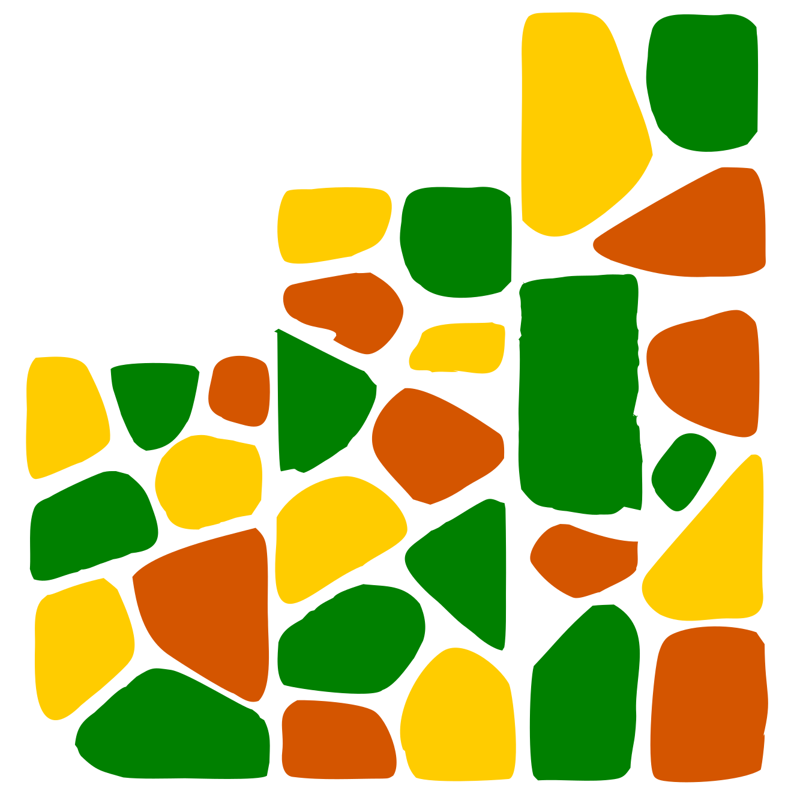

<p align="center">
  
</p>

<h1 align="center">Mosaic</h1>

<p align="center"><b>Your finances, on your machine.</b></p>

<p align="center">
  
  &nbsp;
  
  &nbsp;
  
  &nbsp;
  
  &nbsp;
  
</p>

<p align="center">
  <a href="#why-mosaic">Why Mosaic</a>&nbsp;&bull;&nbsp;<a href="#features-at-a-glance">Features</a>&nbsp;&bull;&nbsp;<a href="#setup">Setup</a>&nbsp;&bull;&nbsp;<a href="FEATURES.md">Full Docs</a>&nbsp;&bull;&nbsp;<a href="CONTRIBUTING.md">Contributing</a>
</p>

---

Mosaic is a personal expense tracker that runs entirely on your own machine. No accounts to create, no subscriptions, no data sent anywhere. Log expenses, understand your spending patterns, and get automated analysis — all locally. When you're ready, it scales to two: a Blended mode lets couples track personal and shared expenses side by side without mixing them up.

---

## Why Mosaic

**Runs locally — your data stays yours.**
Everything lives in a SQLite database on your machine. Mosaic never phones home. No third-party access, no cloud sync unless you explicitly configure it.

**Insights that actually tell you something.**
Mosaic analyses your spending automatically: it detects recurring expenses, flags anomalies, alerts you when a category spikes above its 3-month average, and forecasts next month's spending. No manual setup — it works from the data you've already logged.

**AI-powered description clean-up, on your device.**
Tracked the same grocery store as "Foodbasics", "Food Basics", and "food basics"? The Clean Up tool uses local ONNX embeddings to find description variants that refer to the same thing and lets you merge them in bulk — no API calls, no data leaving your machine.

**A calendar that shows where your money goes.**
A monthly heat-map calendar colours each day by spending intensity using a logarithmic scale, so one large expense like rent doesn't drown out everything else. Click any day to drill into its expenses.

**Scales to two when you need it.**
Blended mode lets couples log personal expenses alongside shared ones. Mosaic tracks the balance, calculates each person's real share based on how each expense was split, and keeps personal spending private.

---

## Features at a glance

| | |
|---|---|
| **Dashboard** | Monthly balance, your expense share, income summary, spend by category, recent activity |
| **Add Expense** | Fuzzy description matching, category auto-suggest, custom categories, flexible split methods |
| **Analytics** | Date-range charts, Sankey income-flow diagram, category drill-down, largest outlays |
| **Calendar** | Heat-map month view, income badges, click-to-filter drill-down |
| **Insights** | Anomaly detection, recurring expense tracker, category trend alerts, spend forecast, weekend vs. weekday analysis |
| **History** | Searchable and filterable expense table, edit, delete, spreadsheet export |
| **Clean Up** | AI embedding-based description deduplication with bulk merge |
| **Modes** | Personal (solo), Shared (split everything), Blended (mix of both) |

Full feature documentation: [FEATURES.md](FEATURES.md)

---

## Tech stack

| Layer | Technologies |
|---|---|
| Backend | Python 3.10+, FastAPI, SQLModel, SQLite (WAL mode), fastembed (ONNX embeddings), bcrypt, openpyxl |
| Frontend | React 18 (Vite), Tailwind CSS 3, React Router 6, Recharts, Fuse.js |

---

## Setup

### Prerequisites

- [Python 3.10+](https://www.python.org/downloads/)
- [Node.js 18+](https://nodejs.org/)

### 1. Clone the repository

```bash
git clone <your-repo-url>
cd Mosaic
```

### 2. Configure the backend

```bash
cd backend
cp config.example.py config.py
```

Create `backend/.env` with a session secret:

```env
SECRET_KEY=<long random string>

# Optional: path to a cloud-synced folder for off-site backups
# BACKUP_PATH=C:/Users/yourname/OneDrive/Mosaic-Backups
```

`SECRET_KEY` is required — the app will not start without it. Generate one:

```bash
python -c "import secrets; print(secrets.token_urlsafe(48))"
```

### 3. Start the backend

```bash
cd backend
python -m venv venv

# Activate the virtual environment
venv\Scripts\activate          # Windows
source venv/bin/activate       # macOS / Linux

pip install -r requirements.txt
uvicorn main:app --reload
```

The API starts at **http://localhost:8000**. The SQLite database (`mosaic.db`) is created automatically on first run. Interactive API docs are at http://localhost:8000/docs.

> **First run note:** The first time you use the Description Clean Up feature, `fastembed` downloads a small embedding model (~45 MB). This is a one-time download cached locally.

### 4. Start the frontend

Open a second terminal:

```bash
cd frontend
npm install
npm run dev
```

Open **http://localhost:5173**. On first visit you will see the login page with a "Create Account" link — create up to 2 accounts through the web UI.

### 5. (Optional) Import existing data

If you have expenses in a `.xlsx` or `.csv` file:

```bash
cd backend
python migrate_expenses.py path/to/expenses.xlsx
```

Expected columns: `Date`, `Description`, `Amount`, `Category`, `Paid By`, `Split Method`.

For income history (Personal / Blended mode only):

```bash
cd backend
python migrate_income.py path/to/income.xlsx
```

Expected columns: `Date`, `Amount`, `Source`, `Display Name`, `Notes` (optional).

### 6. (Optional) CLI password reset

If a user cannot answer their security question, reset from the command line:

```bash
cd backend
python cli_reset_password.py
```

Requires direct access to the host machine.

---

## Starting again later

```bash
# Terminal 1 — Backend
cd backend
venv\Scripts\activate       # or: source venv/bin/activate
uvicorn main:app --reload

# Terminal 2 — Frontend
cd frontend
npm run dev
```

No reinstall needed — dependencies persist in `venv/` and `node_modules/`.

---

## Troubleshooting

| Problem | Fix |
|---|---|
| `SECRET_KEY environment variable is not set` | Create `backend/.env` with a `SECRET_KEY` value |
| `python` not found | Try `python3`, or add Python to your PATH |
| `npm` not found | Install Node.js from https://nodejs.org/ |
| PowerShell blocks `activate` | Run `Set-ExecutionPolicy -ExecutionPolicy RemoteSigned -Scope CurrentUser` |
| Port 8000 already in use | Run `uvicorn main:app --reload --port 8001` and update the API base URL in `frontend/src/config.js` |
| Port 5173 already in use | Vite auto-picks the next available port — check the terminal output |
| CORS errors in the browser | Make sure the backend is running on `localhost:8000` before opening the frontend |
| `.db-shm` / `.db-wal` files appeared | Normal — SQLite WAL mode working files, managed automatically |

---

## Links

- [Features](FEATURES.md) — full feature reference
- [Contributing](CONTRIBUTING.md) — how to contribute
- [License](LICENSE) — MIT
